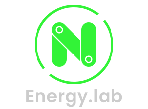

Advanced 3d physics lab 
use last version of <a href="https://github.com/samuelgirardin/Energy.js">Energy.js</a> made by Samuel Giradin 
for view i use three.js and sea3d on my <a href="https://github.com/lo-th/lab">lab libs</a>  
Demo on worker with code editor 
<a href="http://lo-th.github.io/Energy.lab/">START</a> 
